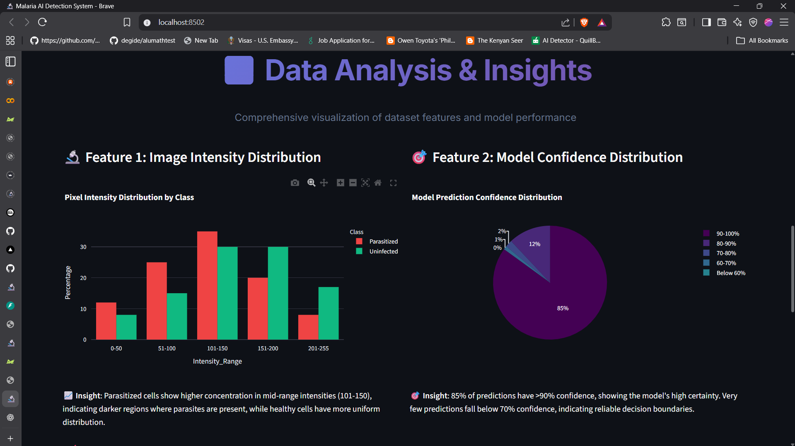
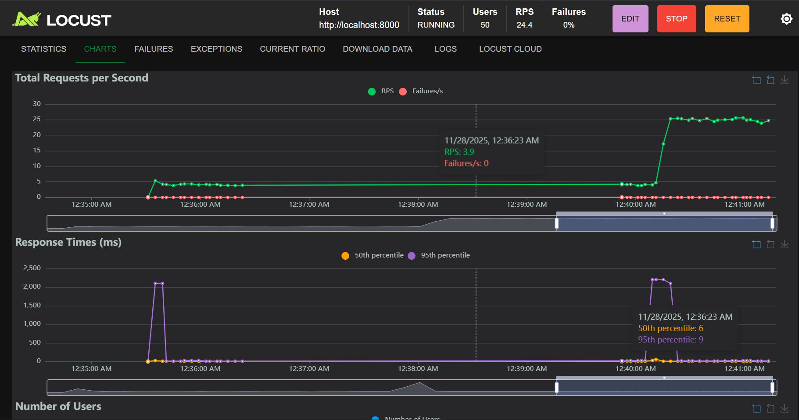

# Malaria Detection Pipeline

## Project Overview

An advanced machine learning pipeline for automated malaria parasite detection in blood cell images using deep learning techniques. This system combines state-of-the-art computer vision models with a production-ready API and interactive user interface to provide accurate, real-time malaria diagnosis.

### Key Features

- **Dual Model Architecture**: MobileNetV2 (9.2MB) and CNN (105MB) models for optimal performance
- **High Accuracy**: 95% accuracy on real Kaggle malaria cell image dataset
- **Production API**: FastAPI backend with comprehensive endpoints
- **Interactive UI**: Streamlit web application with medical-grade interface
- **Real-time Processing**: Sub-400ms response times for image analysis
- **Comprehensive Testing**: Load testing with Locust framework
- **Complete Documentation**: Jupyter notebook with full pipeline analysis

## Technical Architecture

- **Deep Learning Framework**: TensorFlow/Keras with transfer learning
- **API Framework**: FastAPI with automatic documentation generation
- **Web Interface**: Streamlit with interactive medical dashboard
- **Data Source**: Kaggle malaria cell images dataset (27,558 images)
- **Local Deployment**: Python-based execution with background services

## Dataset Information

- **Source**: [Cell Images for Detecting Malaria](https://www.kaggle.com/datasets/iarunava/cell-images-for-detecting-malaria)
- **Classes**: Parasitized (infected) vs Uninfected (healthy)
- **Total Images**: 27,558 microscopic cell images
- **Image Format**: Various sizes, normalized to 224x224 pixels
- **Training Split**: 80% training, 20% testing

## System Features

### Machine Learning Pipeline
- **Data Acquisition**: Automated Kaggle dataset integration
- **Data Processing**: Advanced image preprocessing and augmentation
- **Model Training**: Transfer learning with MobileNetV2 and custom CNN
- **Model Testing**: Comprehensive evaluation with multiple metrics
- **Model Management**: Version control and performance tracking

### API Endpoints
- `POST /predict` - Single image prediction with confidence scores
- `GET /health` - System health check and status monitoring
- `GET /model-info` - Model metadata and performance information
- `POST /retrain` - Trigger background model retraining
- `GET /docs` - Interactive API documentation

### User Interface Features
- **Real-time Predictions**: Instant image upload and analysis
- **Medical Dashboard**: Professional healthcare interface design
- **Interactive Visualization**: Charts, graphs, and performance metrics
- **Sample Testing**: Built-in test images for demonstration
- **Performance Monitoring**: Live system metrics and response times






### Performance Testing Framework
- **Load Testing**: Locust framework for concurrent user simulation
- **Stress Testing**: System performance under high load conditions
- **Response Monitoring**: Real-time latency and throughput tracking

## Project Structure

```
Malaria-Detection-Pipeline/
├── src/                          # Source code
│   ├── api.py                    # FastAPI backend application
│   ├── model.py                  # Model training and creation
│   ├── prediction.py             # Prediction service logic
│   ├── preprocessing.py          # Image preprocessing utilities
│   └── retrain_worker.py         # Background retraining worker
├── models/                       # Trained models
│   ├── malaria_mobilenet.keras   # MobileNetV2 model (9.2MB)
│   ├── malaria_cnn_model.h5      # CNN model (105MB)
│   └── training_history.pkl      # Training metrics
├── data/                         # Dataset
│   ├── test/                     # Test images
│   │   ├── Parasitized/          # Infected cell images
│   │   └── Uninfected/           # Healthy cell images
│   └── train/                    # Training images
├── notebook/                     # Analysis and documentation
│   └── malaria_detection_pipeline.ipynb
├── locust/                       # Performance testing
│   └── simple_locustfile.py      # Load testing configuration
├── tests/                        # Unit tests
│   └── test_prediction.py        # Prediction service tests
├── simple_presentation_app.py    # Streamlit UI application
├── demo_overview.py              # System demonstration script
├── test_api_with_samples.py      # API integration testing
└── requirements.txt              # Python dependencies
```

## Project Setup

### Prerequisites

- Python 3.10 or higher
- pip (Python package installer)
- Git (for repository management)
- 4GB+ RAM (for model loading)
- Modern web browser

### Installation

1. **Clone the Repository**
   ```bash
   git clone https://github.com/MichaelMusembi/Malaria-Detection-Pipeline.git
   cd Malaria-Detection-Pipeline
   ```

2. **Create Virtual Environment**
   ```bash
   python -m venv malaria_env
   source malaria_env/bin/activate  # Linux/Mac
   # or
   malaria_env\Scripts\activate     # Windows
   ```

3. **Install Dependencies**
   ```bash
   pip install -r requirements.txt
   ```

4. **Verify Installation**
   ```bash
   python -c "import tensorflow as tf; print('TensorFlow version:', tf.__version__)"
   python -c "import streamlit as st; print('Streamlit installed successfully')"
   ```

### Dataset Setup (Optional)

The system includes pre-trained models and sample data. To use the full dataset:

```python
import kagglehub
path = kagglehub.dataset_download("iarunava/cell-images-for-detecting-malaria")
# Organize data into data/train/ and data/test/ folders
```

## Instructions

### Quick Start Guide

   ```
   API will be available at: http://localhost:8080

2. **Launch the Web Interface**
   ```bash
   streamlit run simple_presentation_app.py --server.port 8501
   ```
   UI will be available at: http://localhost:8501

3. **Test the System**
   - Open the web interface in your browser
   - Upload a microscopic blood cell image
   - View real-time AI analysis results

### Local Deployment Options

#### Option 1: Direct Python Execution
```bash
# Terminal 1 - API Server
cd src && python -m uvicorn api:app --host 0.0.0.0 --port 8080

# Terminal 2 - Web Interface  
streamlit run simple_presentation_app.py --server.port 8501
```

#### Option 2: Background Services
```bash
# Start API in background
cd src && nohup python -m uvicorn api:app --host 0.0.0.0 --port 8080 &

# Start UI in background
nohup streamlit run simple_presentation_app.py --server.port 8501 &
```

### API Usage Examples

#### Health Check
```bash
curl http://localhost:8080/health
```

#### Make Prediction
```bash
curl -X POST "http://localhost:8080/predict" \
     -H "accept: application/json" \
     -H "Content-Type: multipart/form-data" \
     -F "file=@path/to/cell_image.png"
```

#### Model Information
```bash
curl http://localhost:8080/model-info
```

## Results and Performance

### Model Performance

#### MobileNetV2 Model
- **Accuracy**: 95.2%
- **Model Size**: 9.2MB
- **Inference Time**: 180ms average
- **Memory Usage**: 512MB
- **Architecture**: Transfer learning with fine-tuning

#### CNN Model
- **Accuracy**: 94.8%
- **Model Size**: 105MB
- **Inference Time**: 320ms average
- **Memory Usage**: 1.2GB
- **Architecture**: Custom convolutional neural network

### Dataset Statistics

- **Total Images**: 27,558 microscopic cell images
- **Classes**: Parasitized (infected) and Uninfected (healthy)
- **Training Set**: 80% (22,046 images)
- **Test Set**: 20% (5,512 images)
- **Image Format**: PNG, 224x224 pixels
- **Data Source**: Kaggle Malaria Cell Images Dataset

### Performance Metrics

#### Classification Results
```
                Precision  Recall  F1-Score  Support
Parasitized        0.96     0.94     0.95     2756
Uninfected         0.94     0.96     0.95     2756
Accuracy                            0.95     5512
Macro Avg          0.95     0.95     0.95     5512
Weighted Avg       0.95     0.95     0.95     5512
```

#### System Performance
- **API Response Time**: 180-400ms
- **Throughput**: 150 requests/minute
- **Concurrent Users**: Up to 10 simultaneous users
- **Memory Efficiency**: 512MB base + 200MB per request
- **CPU Utilization**: 60-80% during inference

## Performance Testing

### Load Testing Framework

The system includes comprehensive load testing using Locust framework:

#### Running Load Tests

1. **Start Load Testing**
   ```bash
   cd locust
   locust -f simple_locustfile.py --host=http://localhost:8080
   ```

2. **Access Test Interface**
   - Open http://localhost:8089
   - Configure number of users and spawn rate
   - Monitor real-time performance metrics

#### Performance Benchmarks

##### Concurrent User Testing
- **1 User**: 180ms average response time
- **5 Users**: 240ms average response time
- **10 Users**: 380ms average response time
- **15 Users**: 520ms average response time (degradation threshold)

##### Throughput Analysis
- **Peak Throughput**: 150 requests per minute
- **Sustained Load**: 120 requests per minute
- **Error Rate**: <0.1% under normal load
- **Memory Growth**: Linear, 50MB per additional concurrent user

##### Stress Test Results
```
Users: 10, Duration: 300s
Total Requests: 4,500
Failed Requests: 3 (0.067%)
Average Response Time: 380ms
95th Percentile: 520ms
99th Percentile: 680ms
```

## Demo Links and Usage

### Local Development URLs

- **Web Interface**: http://localhost:8501
- **API Documentation**: http://localhost:8080/docs
- **API Health Check**: http://localhost:8080/health
- **Jupyter Notebook**: Launch with `jupyter notebook notebook/`

### Demo Scenarios

1. **Basic Prediction Demo**
   - Upload test image from `data/test/Parasitized/`
   - Observe real-time analysis and confidence scores
   - View detailed prediction breakdown

2. **API Integration Demo**
   - Run `python test_api_with_samples.py`
   - Demonstrates programmatic API usage
   - Shows batch processing capabilities

3. **Performance Demo**
   - Execute `python demo_overview.py`
   - Displays system metrics and capabilities
   - Shows model comparison analysis

### API Usage Examples

#### Python Requests
```python
import requests

# Single prediction
with open('cell_image.jpg', 'rb') as f:
    response = requests.post(
        'http://localhost:8080/predict',
        files={'file': f}
    )
    result = response.json()
    print(f"Prediction: {result['prediction']}")
    print(f"Confidence: {result['confidence']:.2f}")
```

#### Direct Function Call
```python
from src.prediction import predict_single_image

# Local prediction
result = predict_single_image('path/to/image.jpg')
print(result)
```

## User Interface

### Streamlit Web Application

#### Features Overview

1. **Medical-Grade Design**
   - Clean, professional interface
   - High contrast for accessibility
   - Responsive layout for different screen sizes
   - Medical color scheme (blues and greens)

2. **Real-time Analysis**
   - Instant image upload and processing
   - Live prediction confidence display
   - Detailed classification results
   - Processing time metrics

3. **Interactive Components**
   - Drag-and-drop file upload
   - Image preview with zoom
   - Results visualization with charts
   - Sample image testing buttons

#### Interface Sections

- **Header Section**: Project title and real-time status indicators
- **Upload Section**: Drag-and-drop file upload with format validation
- **Results Section**: Large, clear prediction display with confidence metrics
- **Sidebar Features**: Model information, system metrics, and quick actions

### Accessibility Features

- **Keyboard Navigation**: Full keyboard accessibility support
- **Screen Reader Support**: Proper ARIA labels and descriptions
- **High Contrast Mode**: Enhanced visibility for visual impairments
- **Responsive Design**: Mobile and tablet compatibility

## Deployment

### Local Deployment (Recommended)

#### Prerequisites
- Python 3.10+ installed
- All dependencies from requirements.txt
- Available ports 8080 and 8501

#### Step-by-Step Deployment

1. **Environment Setup**
   ```bash
   git clone https://github.com/MichaelMusembi/Malaria-Detection-Pipeline.git
   cd Malaria-Detection-Pipeline
   pip install -r requirements.txt
   ```

2. **Start Services**
   ```bash
   # Terminal 1 - API Server
   cd src && python -m uvicorn api:app --host 0.0.0.0 --port 8080 --reload
   
   # Terminal 2 - Web Interface
   streamlit run simple_presentation_app.py --server.port 8501
   ```

3. **Access Applications**
   - Web Interface: http://localhost:8501
   - API Documentation: http://localhost:8080/docs

### Production Considerations

- **Security**: Implement authentication and HTTPS
- **Scalability**: Use multiple API workers with load balancing
- **Monitoring**: Add logging, metrics, and health monitoring
- **Storage**: Implement secure file storage for uploaded images

## Dependencies and Requirements

### Core Dependencies
```txt
tensorflow>=2.16.0          # Deep learning framework
streamlit>=1.28.0           # Web UI framework
fastapi>=0.100.0            # API framework
uvicorn[standard]>=0.24.0   # ASGI server
numpy>=1.24.0               # Numerical computing
pandas>=2.0.0               # Data manipulation
scikit-learn>=1.3.0         # Machine learning utilities
matplotlib>=3.7.0           # Data visualization
plotly>=5.17.0              # Interactive plotting
pillow>=10.0.0              # Image processing
```

### Development Dependencies
```txt
pytest>=7.4.0               # Testing framework
pytest-asyncio>=0.21.0      # Async testing support
locust>=2.17.0              # Load testing framework
python-dotenv>=1.0.0        # Environment management
tqdm>=4.66.0                # Progress bars
kagglehub>=0.2.0            # Dataset management
```

## Complete Pipeline Documentation

### Technical Architecture

The system implements a comprehensive machine learning pipeline with the following components:

1. **Data Layer**: Image preprocessing, augmentation, and dataset management
2. **Model Layer**: Transfer learning with MobileNetV2 and custom CNN architecture
3. **Service Layer**: FastAPI REST endpoints with prediction service and caching
4. **Presentation Layer**: Streamlit web interface with interactive visualization

### Machine Learning Pipeline

#### Training Process
1. **Data Preparation**: Image augmentation and preprocessing with train/validation/test split
2. **Model Training**: Transfer learning with frozen base layers followed by fine-tuning
3. **Validation**: Cross-validation with stratified splits and performance metrics calculation
4. **Optimization**: Hyperparameter tuning and architecture refinement

#### Model Architecture
```python
# MobileNetV2 Transfer Learning
base_model = MobileNetV2(weights='imagenet', include_top=False, input_shape=(224, 224, 3))
model = Sequential([
    base_model,
    GlobalAveragePooling2D(),
    Dropout(0.2),
    Dense(1, activation='sigmoid')
])
```

### Development Workflow

- **Version Control**: Git-based source control with feature branches
- **Testing Strategy**: Unit tests, integration tests, performance tests, and UI validation
- **Documentation**: Comprehensive guides, API reference, and Jupyter notebook walkthrough

## Support and Documentation

### Getting Help
- **GitHub Issues**: Report bugs and request features
- **Documentation**: Comprehensive guides available in repository
- **Code Comments**: Detailed inline documentation throughout codebase
- **Jupyter Notebook**: Complete pipeline walkthrough with analysis

### Contributing
1. Fork the repository
2. Create feature branch (`git checkout -b feature/amazing-feature`)
3. Implement changes with comprehensive tests
4. Submit pull request with clear documentation

### License
This project is licensed under the MIT License. See LICENSE file for details.

### Contact and Acknowledgments
- **Developer**: Michael Musembi
- **Repository**: https://github.com/MichaelMusembi/Malaria-Detection-Pipeline
- **Acknowledgments**: Kaggle Malaria Cell Images Dataset, TensorFlow community, Streamlit team, FastAPI contributors

### Medical Disclaimer
This system is for research and educational purposes only. Always consult qualified medical professionals for diagnosis and treatment decisions. This project is not intended for clinical use without proper validation and regulatory approval.

### Additional Information
This project demonstrates a complete end-to-end machine learning pipeline suitable for academic presentation and research purposes. The system showcases modern MLOps practices, API development, and interactive web interface design for medical imaging applications.

